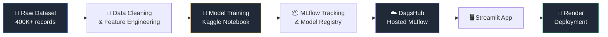

<div align="center">

# 💳 EMI Prediction Platform

### AI-Powered Financial Risk Assessment & EMI Eligibility System

[](https://www.python.org/)
[](https://streamlit.io/)
[](https://mlflow.org/)
[](https://xgboost.readthedocs.io/)
[](https://dagshub.com/)
[](https://render.com/)

[](LICENSE)
[]()
[]()

*Predicting EMI eligibility and safe monthly repayment limits using Machine Learning, tracked and versioned end-to-end with MLflow.*

**🔗 [Live App](https://emi-prediction-platform.onrender.com/) • [Features](#-features) • [Architecture](#-architecture) • [Setup](#-setup) • [Model Performance](#-model-performance)**

</div>

---

## 📌 Overview

The **EMI Prediction Platform** is a full-stack machine learning application that helps financial institutions assess loan applicants on two fronts:

| Task | Description | Output |
|------|-------------|--------|
| 🎯 **Classification** | Determine applicant risk category | `Eligible` / `High Risk` / `Not Eligible` |
| 📈 **Regression** | Estimate a safe maximum monthly EMI | ₹ Amount |

Built with a production-style MLOps pipeline — from raw data to a deployed, interactive web app.

**👉 Try it live: [emi-prediction-platform.onrender.com](https://emi-prediction-platform.onrender.com/)**
*(Free-tier hosting — the app may take 30–50 seconds to wake up on first load.)*

---

## ✨ Features

<table>
<tr>
<td width="50%">

### 🔮 Real-Time Predictions
Instant eligibility & EMI estimates from live applicant data, powered by models served straight from the MLflow Model Registry.

### 📊 Interactive Dashboards
Visualize prediction trends, eligibility distribution, and EMI patterns across all evaluated applicants.

</td>
<td width="50%">

### 🗃️ Full CRUD Management
Create, view, update, and delete applicant records through a clean, database-backed admin interface.

### 🧪 MLflow Model Dashboard
Live model metrics (accuracy, F1, RMSE, R²) pulled directly from the registry — no manual refresh needed.

</td>
</tr>
</table>

---

## 🏗️ Architecture



---

## 🧠 Model Performance

<div align="center">

### Classification — `EMI_Eligibility_Classifier`

| Model | Accuracy | F1 Score | ROC-AUC |
|:-----:|:--------:|:--------:|:-------:|
| Logistic Regression | 89.18% | 87.21% | 92.40% |
| Random Forest | 93.70% | 91.71% | 96.94% |
| **XGBoost** 🏆 | **96.88%** | **96.47%** | **99.17%** |

### Regression — `Max_EMI_Regressor`

| Model | RMSE (₹) | R² Score |
|:-----:|:--------:|:--------:|
| Linear Regression | 4,140.52 | 0.7162 |
| Random Forest | 1,104.92 | 0.9798 |
| **XGBoost** 🏆 | **761.76** | **0.9904** |

</div>

> ✅ Both winning models exceed the project targets: **>90% classification accuracy** and **<₹2,000 regression RMSE**.

---

## 🛠️ Tech Stack

<div align="center">

| Layer | Technology |
|-------|-----------|
| **Language** |  |
| **ML Models** |   |
| **Experiment Tracking** |  |
| **Model Registry Host** |  |
| **Web App** |  |
| **Database** |  |
| **Deployment** |  |
| **Training Environment** |  |

</div>

---

## 📂 Project Structure

```
emi-prediction-platform/
├── app.py                  # Streamlit multi-page application
├── requirements.txt        # Python dependencies
├── scaler.pkl               # Fitted StandardScaler (training preprocessing)
├── label_encoders.pkl       # Fitted LabelEncoders for categorical features
├── target_encoder.pkl       # LabelEncoder for the eligibility target
├── secrets.toml.example    # Template for MLflow credentials (never commit real secrets)
└── README.md                # You are here
```

---

## ⚙️ Setup

### 1️⃣ Clone the repository

```bash
git clone https://github.com/Ankit-builds1/emi-prediction-platform.git
cd emi-prediction-platform
```

### 2️⃣ Install dependencies

```bash
pip install -r requirements.txt
```

### 3️⃣ Configure secrets

Create a `.streamlit/secrets.toml` file (see `secrets.toml.example`), or set the same three values as environment variables when deploying elsewhere:

```toml
DAGSHUB_USERNAME = "your_username"
DAGSHUB_TOKEN = "your_token"
DAGSHUB_REPO = "emi-prediction-platform"
```

### 4️⃣ Run locally

```bash
streamlit run app.py
```

---

## 🚀 Live Demo

> 🔗 **App:** [emi-prediction-platform.onrender.com](https://emi-prediction-platform.onrender.com/)

> 📈 **MLflow Experiments (DagsHub):** [View Experiments](https://dagshub.com/omm061812/emi-prediction-platform/experiments)

---

## 📋 Dataset

- **404,800 rows** × 27 columns
- Features: demographics, income, expenses, credit history, loan request details
- Targets: `emi_eligibility` (classification), `max_monthly_emi` (regression)

---

## 🗺️ Roadmap

- [x] Data cleaning & EDA
- [x] Feature engineering
- [x] Model training (3+ classifiers, 3+ regressors)
- [x] MLflow experiment tracking & model registry
- [x] Streamlit multi-page app with CRUD
- [x] MLflow dashboard integration
- [x] Public deployment on Render
- [x] CI/CD pipeline (GitHub push → Render auto-build & deploy)

---

<div align="center">

### 👤 Author

**Ankit Dash** — Internship Project, 2026

⭐ If you found this useful, consider starring the repo!

</div>
